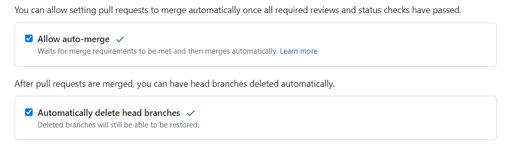

# React in GitHub template (RiGHt👉)

This is a React + Vite PWA template running for starting a new project.
It's made for GitHub (CI/CD with GH Actions + publish with GH Pages).

## Setup

### Clone the repo

```shell
git clone https://github.com/nmerget/right.git my-awesome-project

# or

git clone git@github.com:nmerget/right.git my-awesome-project
```

### Install dependencies

`npm install`

### Rename the default repo

`node scripts/rename.js -n \"My Awesome Project\" -sn my-awesome-project`

### Add a custom app icon

Replace the `public/app-icon.png` with an own icon and run `npm run generate:manifest-icons`

### Update manifest

Goto `manifest.ts` and change the config by your preferences. For more information look at [this](https://vite-pwa-org.netlify.app/guide/pwa-minimal-requirements.html#web-app-manifest).

### Start coding

All your setup is done. Run `npm run dev` and start writing code inside the `src` folder.

## Configure for GitHub

1. Create a new repo in GH and change the origin
2. Your default branch should be `main` so the pipeline works out of the box
3. Push an `Initial commit` to your repo and the pipeline should trigger the GitHug Pages publish

### Recommendations

1. Enable `Allow auto-merge` and `Automatically delete head branches` inside `Settings/General`


